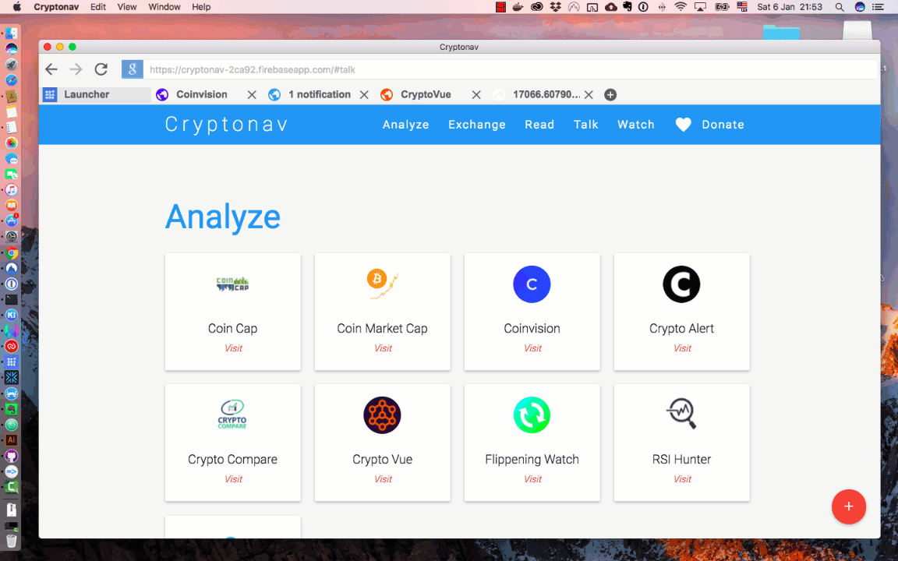
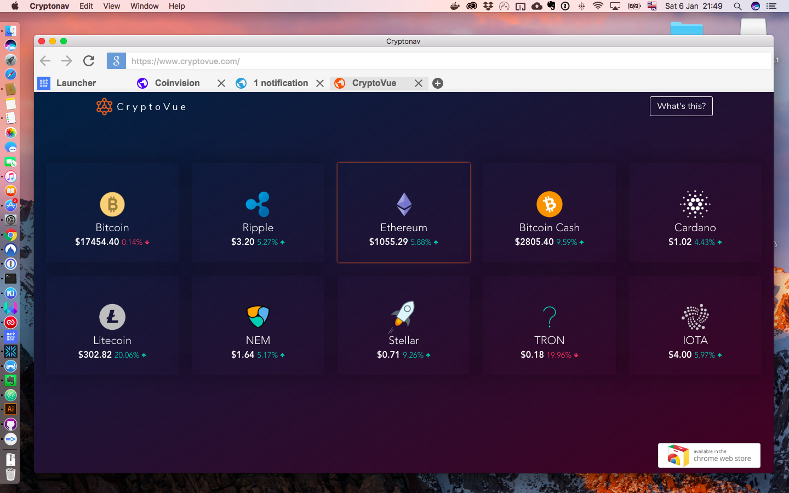

# Cryptonav
## Web Browser for Cryptocurrency Enthusiasts.

## Description
It's a web browser developed with Electron 1.7.10 and Electron-naviagion 1.5.3 focused on crypto content. It comes with a built-in collection of websites to help you analyze, trade, and get informed within the crypto world.

### Technology
Project developed with Electron 1.7.10 and module Electron-navigation 1.5.3
